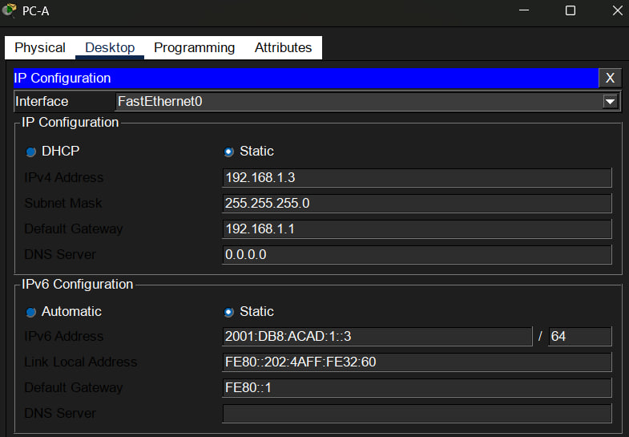
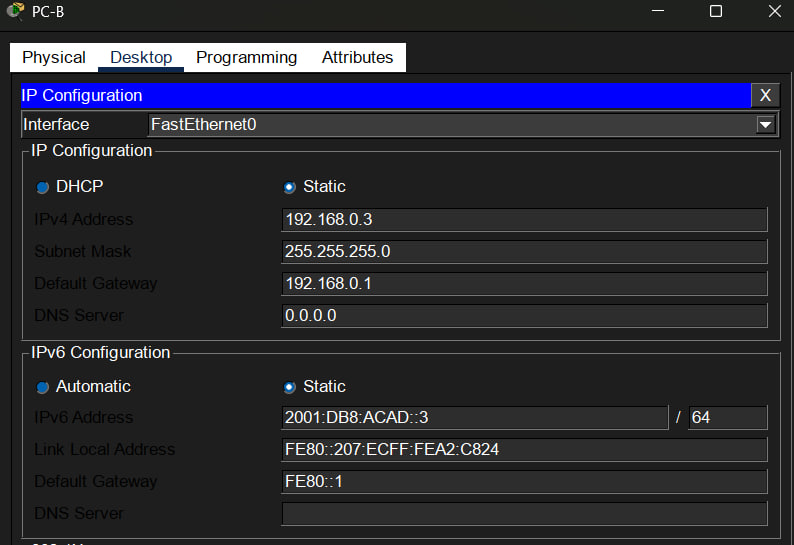

# Build a Switch and Router Network – Physical Mode
## 📄Description
A small network was configured, consisting of router R1, switch S1, and two end devices PC-A and PC-B.
## 📌Objectives
✔ Configure IPv4 and IPv6 addressing  
✔ Configure basic router and switch settings   
✔ Configure passwords and device access  
✔ Verify end-to-end connectivity  
## 🌐Network Topology

## 📋Addressing Table

## 🖥️PC Configuration
<h3><b>PC-A </b></h3>

<h3><b>PC-B </b></h3>

## ⚙️Router and switch configuration
<h3><b>Router R1 </b></h3>

<h3><b>Switch S1 </b></h3>

## 🔍Verification
After configuration, connectivity and device settings were verified using `show` commands.  
<h3><b>Router R1 </b></h3>

The `show ip route` command displays the IPv4 routing table and the connected networks.  
The `show ipv6 route` command displays the IPv6 routing table and the connected networks.  

  

The `show ip interface brief` command displays the IPv4 addresses and current status of the router interfaces (both interfaces are operational).  

<h3><b>Switch S1 </b></h3>

  

The `show ip interface brief` command displays the status of the switch management interface - `Vlan 1` is active.

## 🧪Testing
The tests were performed using the `ping` command from PC-A to PC-B and from switch S1 to PC-B. 

<h3><b>PC-A → PC-B </b></h3>

  

<h3><b>S1 → PC-B </b></h3>

  

All ping packets were successfully sent.

## 🛠️Troubleshooting 
The initial ping from PC-A to PC-B was unsuccessful because the router interfaces had not yet been configured, so Layer 3 traffic could not be routed between the subnets.

## 📚What I Learned
<b>During this lab I practiced:</b> 
➜ Configuring router interfaces and a switch management interface 
➜ Configuring IPv4 and IPv6 addresses 
➜ Enabling IPv6 routing 
➜ Checking routing tables 
➜ Checking interface status 
➜ Testing end-to-end connectivity with ping 
➜ Troubleshooting basic network connectivity problems 
