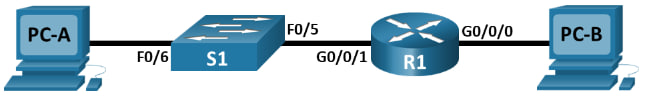
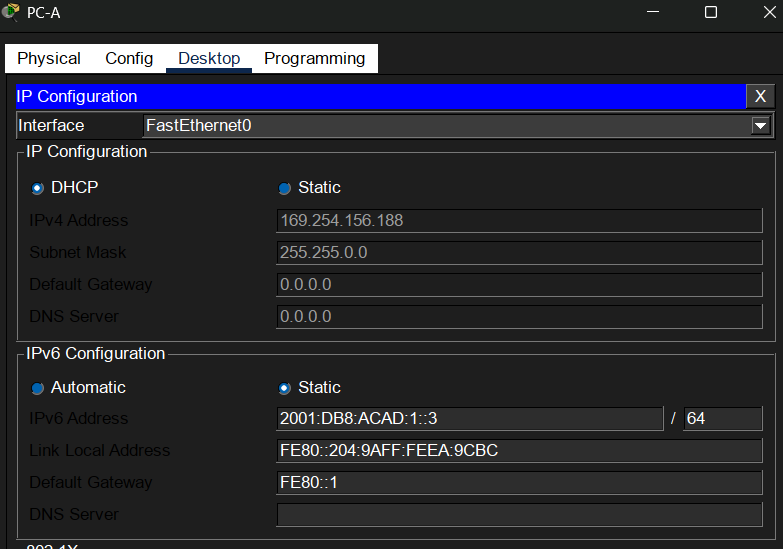
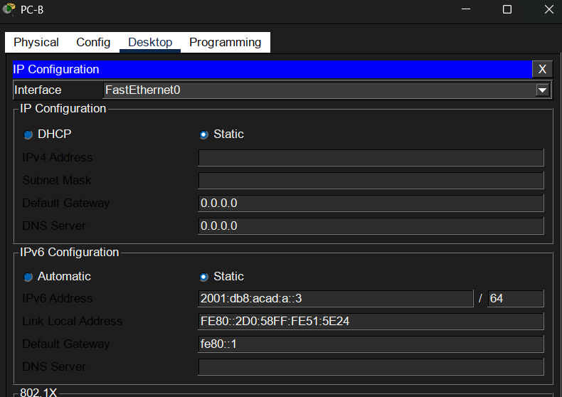
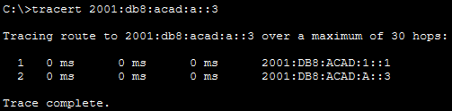

# Configure IPv6 Addresses on Network Devices - Physical Mode
## 📄Description
IPv6 addresses were manually configured on the router, switch, and PCs. IPv6 routing was enabled on router R1, allowing hosts to receive network information through SLAAC. The configuration was then verified using IPv6 `show` commands, `ping`, and `tracert`.

## 📌Objectives
✔ Set Up Topology and Configure Basic Router and Switch Settings  
✔ Configure IPv6 Addresses Manually   
✔ Verify End-to-End Connectivity  
## 🌐Network Topology

## 📋Addressing Table

## 🖥️PC Configuration
<h3><b>PC-A </b></h3>

<h3><b>PC-B </b></h3>

## ⚙️Router and switch configuration
<h3><b>R1 </b></h3>
The device’s basic settings have been configured.

IPv6 global unicast addresses were assigned to both Ethernet interfaces. The same link-local address fe80::1 was manually configured on both interfaces.

<h3><b>S1 </b></h3>
The device’s basic settings have been configured.

The management interface VLAN 1 was configured with an IPv6 address.

## 🔍Verification
<h3><b>R1 </b></h3>

This command displays the IPv6 addresses and status of the router interfaces `show ipv6 interface g0/0/0`. 
 
This command verifies the IPv6 configuration of the interface, including its link-local address, global unicast address, and multicast groups.

The IPv6 configuration was verified using `show ipv6 interface brief`. 
 
This command displays the IPv6 addresses and status of the router interfaces.

<h3><b>S1 </b></h3>

This command displays the IPv6 addresses and status of the VLAN 1 management interface `show ipv6 interface vlan1`. 
 

## 🧪Testing
Connectivity was tested using `ping` command.
<h3><b>Ping from PC-A to G0/0/1 on R1 </b></h3>

<h3><b>Ping from PC-B to G0/0/0 on R1 </b></h3>

<h3><b>Ping from PC-B to PC-A </b></h3>

<h3><b>Tracert </b></h3>

From PC-A, I used the `tracert` command to verify that I have end-to-end connectivity to PC-B.  
 
All the tests were successful.
## 📚What I Learned
<b>During this lab I practiced:</b> 
➜ How to configure IPv6 addresses manually  
➜ How link-local and global unicast IPv6 addresses work  
➜ How to enable IPv6 routing on a Cisco router  
➜ How SLAAC provides hosts with IPv6 addressing information  
➜ How to verify IPv6 configuration using Cisco IOS commands  
➜ How to test IPv6 connectivity using ping and tracert  
